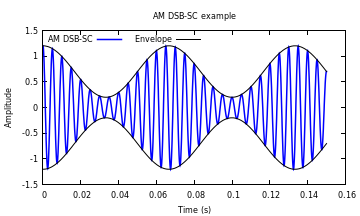
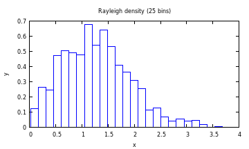
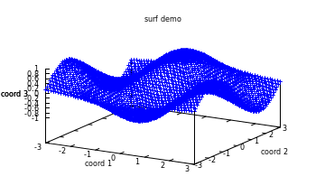

<style>
.reveal code.r {
  font-size: large
}
</style>

Graphics in Julia
========================================================
author: Andee Kaplan
date: 09-10-2014

Packages
========================================================

There are multiple packages written for Julia that facilitate graphics. The main difference between their use is the api syntax.

- [Winston](http://winston.readthedocs.org/en/latest/) (Matlab)
- [Gaston](https://github.com/mbaz/Gaston.jl) (gnuplot)
- [ASCIIPlots](https://github.com/johnmyleswhite/ASCIIPlots.jl) (Exactly what you think it is. I'm not joking.)
- [PyPlot](https://github.com/stevengj/PyPlot.jl) (Python matplotlib)
- [Gadfly](http://dcjones.github.io/Gadfly.jl/) (grammar of graphics)

Winston
========================================================
- ~~Static~~ 2D plotting library for Julia
- Syntax similar to Matlab


```r
using Winston

x = rand(10);
y = rand(10);
plot(x, y, "bo");

savefig("winston_plot.pdf");
```

Winston Example Plot
========================================================
In order to print the plot, must save the plot, and insert into a `div` below.

<div align = "center">
  <object data="plots-julia/winston_plot.svg" type="image/svg+xml" width="600" height="400"></object>
</div>

Winston Capabilities/Limitations
=======================================================
- Basic plotting functionality 
  - scatter plots, line plots, bar charts(ish)
  - plotting functions
  - titles/labels
  - saving (pdf, svg, png, eps)
- Very sparse documentation
- Syntax not very intuitive (to me)
- Limited options/flexibility


Gaston
========================================================
- Wrapper for utilizing `gnuplot` from Julia
- ~~Static~~ 2D plots, 3D surfaces, and image plots


```r
using Gaston

#2D plot
t = 0:0.0001:.15
carrier = cos(2pi*t*200)
modulator = 0.7+0.5*cos(2pi*t*15)
am = carrier.*modulator
plot(t,am,"color","blue","legend","AM DSB-SC","linewidth",1.5,
t,modulator,"color","black","legend","Envelope",
t,-modulator,"color","black","title","AM DSB-SC example",
"xlabel","Time (s)","ylabel","Amplitude",
"box","horizontal top left")
set_filename("plots-julia/gaston_2d.png")
printfigure("png")
```

Gaston Code (cont'd)
==========================================================================

```r
#Histogram
y = sqrt( randn(1000).^2 + randn(1000).^2 )
histogram(y,"bins",25,"norm",1,"color","blue","title","Rayleigh density (25 bins)")
set_filename("plots-julia/gaston_histo.png")
printfigure("png")

#3D Surface
gnuplot_send("set view 67,25")
surf(-3:.1:3,-3:0.1:3,(x,y)->cos(x)*sin(y),"plotstyle","points",
"xlabel","coord 1","ylabel","coord 2","zlabel","coord 3",
"title","surf demo","color","blue")
set_filename("plots-julia/gaston_3d.png")
printfigure("png")
```

Gaston Example Plots
=============================================================
</img>
</img>
</img>

Gaston Capabilities/Limitations
=======================================================
- Basic plotting functionality 
  - scatter plots, line plots, histograms, surfaces, etc.
  - can overlay histograms/line charts with "mid-level" plotting
  - titles/labels
  - saving (pdf, svg, png, gif)
- Decent documentation (plus documentation for `gnuplot` is extensive)
- Limited flexibility
- Installation issues (more of a `gnuplot` issue than `Gaston`)


ASCIIPlots
=======================================================
- So bad it's good?


ASCIIPlots - A real thing
=======================================================

```r
using ASCIIPlots
x = rand(10);
y = rand(10);
scatterplot(x, y, sym='*')
```

Beautiful
======================================================
<pre>
  -------------------------------------------------------------
	|           *                                                | 1.05
	|                 **                                         |
	|               *   * *                                      |
	|       ***                                                  |
	|                      *                                     |
	|   *                                                        |
	|                                                            |
	|*                                                           |
	|* *                         *                               |
	|*                            *                             *|
	|                                                            |
	|                                                            |
	|                               *                          * |
	|                                 *                          |
	|                                                            |
	|                                                            |
	|                                     *   *      *           |
	|                                       *    *   *           |
	|                                                            |
	|                                            **              | -1.15
	-------------------------------------------------------------
	0.11                                                    6.17


</pre>

PyPlot
========================================================
- Wrapper for utilizing `matplotlib` (Python) from Julia
- Uses the Julia PyCall package to call `matplotlib` directly from Julia
- (Sort of/Maybe?) ~~interactive~~ 2D and 3D plots


```r
using PyPlot
x = 0:.5:5
y = exp(-x)

errorbar(x, y, xerr=0.2, yerr=0.4)
savefig("plots-julia/PyPlot_errorbar.svg")

##Scatterplot
N = 50
x = rand(N)
y = rand(N)
colors = rand(N)
area = pi * (15 * rand(N))

scatter(x, y, s=area, c=colors, alpha=0.5)
savefig("plots-julia/PyPlot_scatter.svg")
```

PyPlot Example Plot
=======================================================
<div align = "center">
  <object data="plots-julia/PyPlot_errorbar.svg" type="image/svg+xml" width="450" height="500"></object>
  <object data="plots-julia/PyPlot_scatter.svg" type="image/svg+xml" width="450" height="500"></object>
</div>

PyPlot Animations!
=======================================================
<video width="600" height="400" controls>
  <source src="plots-julia/PyPlots-sinplot.mp4" type="video/mp4">
</video>

PyPlot Animations!
=======================================================

```r
using PyCall
using PyPlot
@pyimport matplotlib.animation as anim

# First set up the figure, the axis, and the plot element we want to animate
fig = figure()
ax = plt.axes(xlim=(0, 2), ylim=(-2, 2))
global line = ax[:plot]([], [], lw=2)[1]

# initialization function: plot the background of each frame
function init()
    global line
    line[:set_data]([], [])
    return (line,None)
end

# animation function.  This is called sequentially
function animate(i)
    x = linspace(0, 2, 1000)
    y = sin(2 * pi * (x - 0.01 * i))
    global line
    line[:set_data](x, y)
    return (line,None)
end

# call the animator.  blit=True means only re-draw the parts that have changed.
myanim = anim.FuncAnimation(fig, animate, init_func=init,
                               frames=100, interval=20)

myanim[:save]("plots-julia/PyPlots-sinplot.mp4", extra_args=["-vcodec", "libx264", "-pix_fmt", "yuv420p"])
```
[[Source](http://jakevdp.github.io/blog/2013/05/12/embedding-matplotlib-animations/)]

PyPlot Capabilities/Limitations
=======================================================
- Basic plotting functionality 
  - scatter plots, line plots, histograms, surfaces, etc.
  - LaTeX titles/labels
  - saving (png, pdf, ps, eps, svg)
- Very flexible
- Animations!
- Limited documentation (but documentation for `matplot` is extensive)

Gadfly
========================================================
- Implementation of the grammar of graphics in Julia
- No longer using D3 in rendering


```r
using Gadfly
using RDatasets
p1 = plot(dataset("datasets", "iris"), x="SepalLength", y="SepalWidth", Geom.point)
p2 = plot(dataset("car", "SLID"), x="Wages", color="Language", Geom.histogram)

draw(SVGJS("plots-julia/gadfly_scatter.js.svg", 6inch, 6inch), p1)
draw(SVGJS("plots-julia/gadfly_hist.js.svg", 6inch, 6inch), p2)
```


Interaction?
========================================================
<div align = "center">
  <object data="plots-julia/gadfly_scatter.js.svg" type="image/svg+xml" width="49%" height="400"></object>
  <object data="plots-julia/gadfly_hist.js.svg" type="image/svg+xml" width="49%" height="400"></object>
  <object data="plots-julia/gadfly_functions.js.svg" type="image/svg+xml" width="600" height="400"></object>
</div>

Not really.
=======================================================


Something cool
======================================================

```r
p3 = plot([sin, cos], 0, 25)
draw(SVGJS("plots-julia/gadfly_func.js.svg", 6inch, 6inch), p3)
```
<div align = "center">
  <object data="plots-julia/gadfly_func.js.svg" type="image/svg+xml" width="600" height="400"></object>


Gadfly Capabilities/Limitations
=======================================================
- Plotting capabilities
  - Layers -- Gadfly can draw multiple layers to the same plot
  - LaTeX titles/labels
  - saving (png, pdf, ps, eps, svg , svg-js)
- Very flexible
- Beautiful plots
- Limited documentation
- Slow
- Some interactivity with `interact.jl` and `reactive.jl`, but same can be said for all graphics libraries


