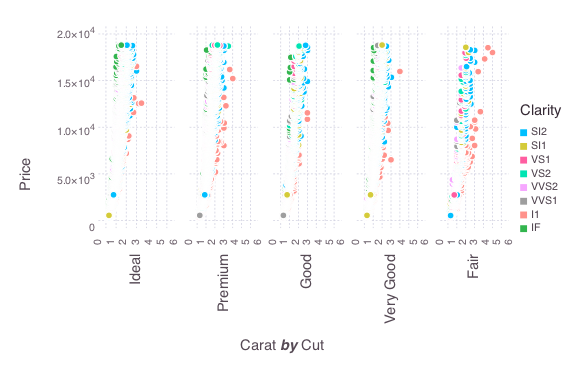

```{r set-hook, echo=FALSE}
library(knitr)
opts_chunk$set(tidy = F, comment = "#>")
# thanks Ramnath -- https://ramnathv.github.io/posts/verbatim-chunks-knitr/
knit_hooks$set(source = function(x, options){
  if (!is.null(options$verbatim) && options$verbatim){
    opts = gsub(",\\s*verbatim\\s*=\\s*TRUE\\s*", "", options$params.src)
    bef = sprintf('\n\n    ```{r %s}\n', opts, "\n")
    stringr::str_c(
      bef, 
      knitr:::indent_block(paste(x, collapse = '\n'), "    "), 
      "\n    ```\n"
    )
  } else {
    stringr::str_c("\n\n```", tolower(options$engine), "\n", 
      paste(x, collapse = '\n'), "\n```\n\n"
    )
  }
})
```


## knitr engines

* knitr has built-in support for some "engines" including (but not limited to):
    * "popular" languages (python, perl, fortran, haskell, etc.)
    * various "command-line tools" (sed, awk, bash, sh, zsh, etc.)
* Unfortunately, for each knitr chunk that does __not__ have `'R'` as it's `engine` option
    * a new session is opened
    * code is parsed and evaluated in that session (or set `eval = FALSE`)
    * results are returned and the session is closed
* Opening & closing sessions can be expensive, so ideally, we open __one__ new session and only ship code when necessary. 
    * Yihui wrote the [runr](https://github.com/yihui/runr) package with this idea in mind.
  
## A julia engine for knitr!

```{r setup, verbatim = TRUE}
library(knitr)
library(runr)
j = proc_julia()
j$start()
knit_engines$set(julia = function(options) {
    knitr:::wrap(j$exec(options$code), options)
})
```

```{r hello, verbatim = TRUE, engine = 'julia'}
string("Hello", " World!")
```

## Now using Gadfly!

```julia
using Gadfly, RDatasets
diamonds = dataset("ggplot2", "diamonds");
p = plot(diamonds, x = "Carat", y = "Price", color = "Clarity")
```

> - It's probably best to generate plots in an interactive session, then save to your favorite file format:

```julia
draw(PDF("diamonds.pdf", 8inch, 6inch), p);
draw(PNG("diamonds.png", 8inch, 6inch), p);
draw(SVG("diamonds.svg", 8inch, 6inch), p);
draw(SVGJS("diamonds.js.svg", 8inch, 6inch), p);
```

> - `SVGJS` has ability to pan and zoom (include in your HTML docs like so):

```html
<div align = "center">
  <object src="diamonds.js.svg" type="image/svg+xml"></object>
</div>
```

---

<div align = "center">
  <object data="diamonds.js.svg" type="image/svg+xml" width="800" height="600"></object>
</div>


## Some notes

* "diamonds.js.svg" is a 8.6 MB file! We've already hit the limitations of the browser with =~ 50,000 row dataset.
* Overplotting clearly is an issue, but [people are working on adding opactiy aesthetics](https://github.com/dcjones/Gadfly.jl/pull/224).


## Geom.subplot_grid() =~ facet_grid()

```julia
p = plot(diamonds, x = "Carat", y = "Price", color = "Clarity",
         xgroup = "Cut", Geom.subplot_grid(Geom.point))
```

which is analogous to 

```r
library(ggplot2)
p = qplot(data = diamonds, x = carat, y = price, colour = clarity, 
          facets = ~cut, geom = "point")
```

The subtle difference is that `subplot_grid` is __specific to a geometry__. The reason for this is to eventually support _embedded plots_: two-tiered graphics that embed subplots within a set of axes.

---

<div align="center">
  
</div>

## For sake of comparison...

```{r diamonds, echo = FALSE, cache = TRUE, fig.align='center', fig.width=10}
library(ggplot2)
data(diamonds)
p = qplot(data = diamonds, x = carat, y = price, colour = clarity, 
          alpha = 0.1, facets = ~cut, geom = "point")
p
```

* Currently no `facet_wrap` equivalent, only `facet_grid` (can't specify nrow or ncol).

## Drawbacks to using `engine = 'julia'`

* `cache = TRUE` doesn't really work
    * This is a big headache when doing expensive computations.
    * Saving/loading objects is fairly trivial for R, but it's not clear if and how this should for Julia  (or other languages for that matter?)
* IPython/IJulia has much better support for saving work.
* Make sure to `j$stop()` the julia session that we started at the beginning! 

```{r, echo=FALSE}
j$stop()
```