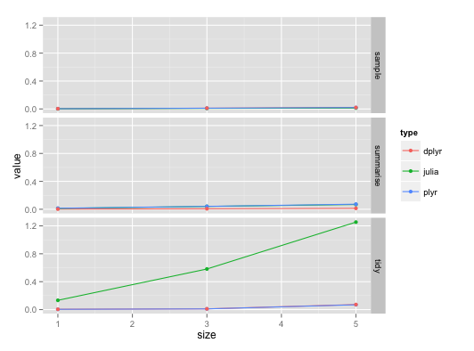
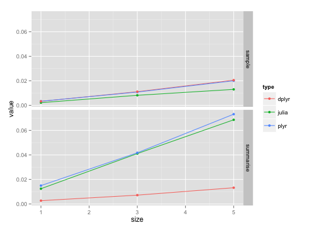

Benchmarking: Hadleyverse vs Julia
========================================================
author: Eric Hare
font-family: Helvetica
date: 2014-12-10

DataFrames Package
========================================================

Extends base Julia by adding features needed for statistical computing

- Missing values 
- Data arrays that efficiently store missing values
- Tabular dataset

http://dataframesjl.readthedocs.org/en/latest/introduction.html

RDatasets Package
========================================================
Contains several common datasets that we are used to

    using DataFrames, RDatasets
    diamonds = dataset("ggplot2", "diamonds")

https://github.com/johnmyleswhite/RDatasets.jl

Emulating the Hadleyverse
========================================================

http://dataframesjl.readthedocs.org/en/latest/split_apply_combine.html

Three Benchmarks
========================================================
1. Summarising a dataset
2. Sampling from a dataset
3. Tidying a dataset

1. Summarising a dataset
========================================================
* In old-hadleyverse, accomplished with `plyr::ddply` and `plyr::summarise`
* In new-hadleyverse, accomplished with `dplyr::summarise`
* In Julia, accomplished with `by()`

2. Sampling from a dataset
========================================================
* Not really an old hadleyverse... would just use `base::sample()`
* In new-hadleyverse, accomplished with `dplyr::sample_n`
* In Julia, accomplished with `sample()` as well

3. Tidying a dataset
========================================================
* In old-hadleyverse, accomplished with `reshape2::melt`
* In new-hadleyverse, accomplished with `tidyr::gather`
* In Julia, accomplished with `stack()`

Results
========================================================

Results
========================================================

